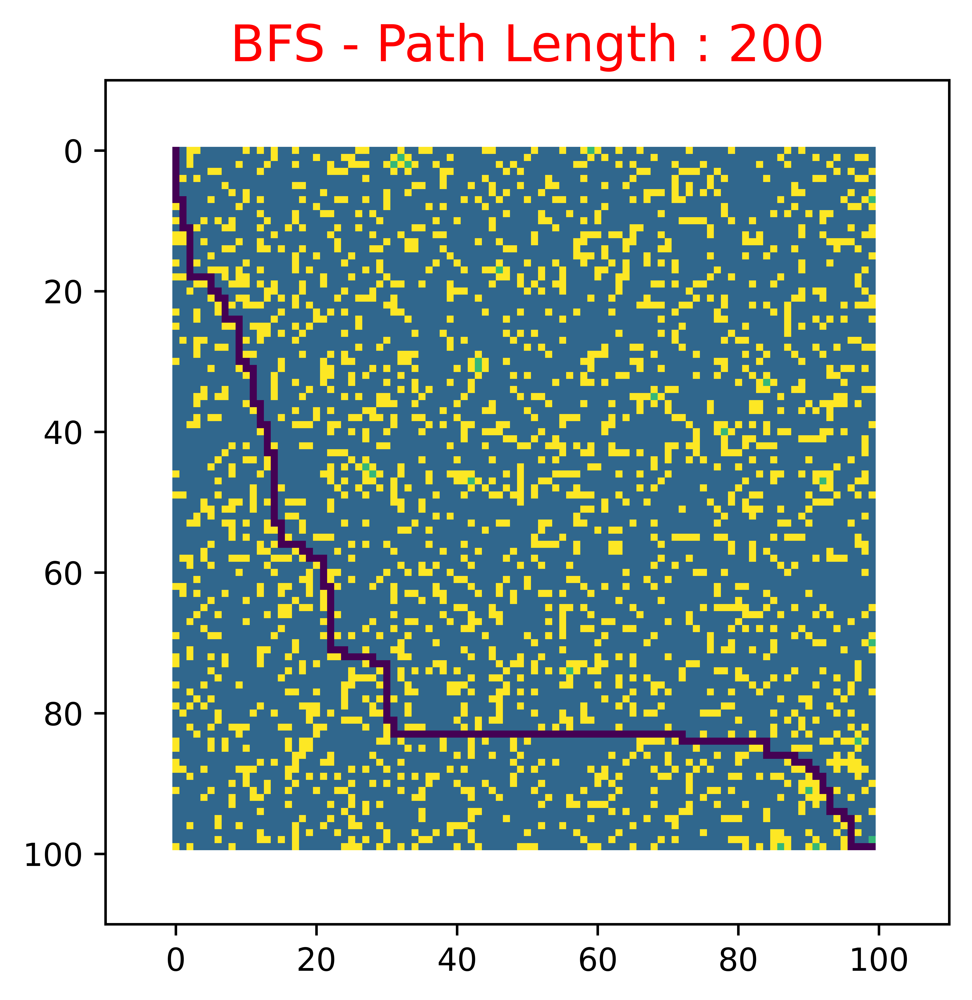

# Maze-Search

This project explores various traversal algorithms to solve mazes, analyzing their trade-offs and efficiencies.

## Overview

The repository implements and compares different pathfinding algorithms, providing insights into their performance and suitability for various maze configurations.

## Features

- **Maze Generation**: Tools to create random mazes of varying complexity.
- **Search Algorithms**:
  - **Depth-First Search (DFS)**: Explores as far as possible along each branch before backtracking.
  - **Breadth-First Search (BFS)**: Explores all neighbors at the present depth before moving on to nodes at the next depth level.
  - **A* Search**: Combines the strengths of BFS and heuristics to find the shortest path efficiently.
- **Visualization**: Graphical representation of mazes and the paths found by different algorithms.

## Getting Started

### Prerequisites

- Python 3.x
- Required Python packages (listed in `requirements.txt`)

### Installation

1. **Clone the repository**:
   ```bash
   git clone https://github.com/sivaranjanij/Maze-Search.git
   cd Maze-Search
   ```

2. **Install dependencies**:
   ```bash
   pip install -r requirements.txt
   ```

### Usage

Run the main script to generate a maze and solve it using the desired algorithm:

```bash
python main.py --algorithm [algorithm_name]
```

Replace `[algorithm_name]` with one of the following:

- `dfs` for Depth-First Search
- `bfs` for Breadth-First Search
- `a-star` for A* Search

For example:

```bash
python main.py --algorithm bfs
```

### Visualization

The program will display the maze and the path found by the selected algorithm. Ensure you have a graphical environment to view the visualizations.




## Project Structure

- `generator/`: Contains scripts for maze generation.
- `search_algorithms/`: Implements the various search algorithms.
- `util/`: Utility functions and helpers.
- `figures/`: Stores images and figures related to the project.
- `main.py`: The main script to run the maze solver.

## Contributing

Contributions are welcome! Please fork the repository and submit a pull request with your improvements or fixes.

## License

This project is licensed under the MIT License. See the `LICENSE` file for details.

## Acknowledgments

Inspired by various pathfinding algorithm visualizations and educational resources on graph traversal techniques.
